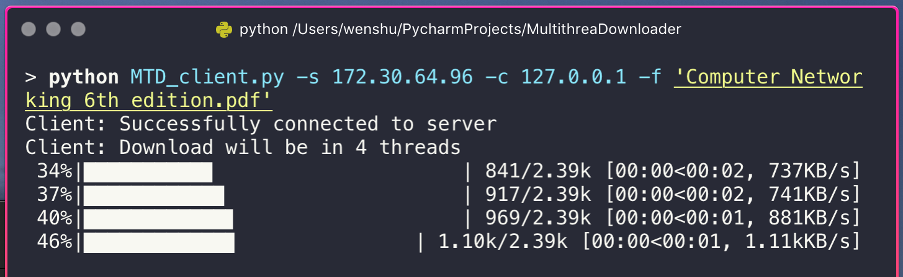

# Multi-threaded Downloader

This is a group project for SUTD 50.012 Networks.  

<a href='Strawman Proposal.pdf'>Strawman Proposal</a><br>
<a href='Networks Project Report.pdf'>Project Report</a><br>

## Getting Started

Clone the repository. The client and the server can run from the same host or different ones.  

Use of a virtual environment is encouraged.

### Dependencies

* Python 3
* Click
* filesplit
* tqdm

Install the dependencies using pip:
```
pip3 install Click filesplit tqdm
```

## How to Use
This programme consists of a client and a server.  

1. Launch the server from command line  
`python3 MTD_server.py -s {server IP address}`  

    other options:
    * `--server-tcp-port {port number}` to manually set the TCP port number. Default is 12001.
    * `-r {transmission rate}` to manually set the transmission rate in Mbps. Default is 10000.0 Mbps.

2. Start the client from command line  
`python3 MTD_client.py -c {client IP address} -s {server IP address} -f {file to download}`  

    other options:
    * `--client-udp-port {port number}` to manually set the UDP port number. Default is 50000.
    * `--server-tcp-port {port number}` to manually set the TCP port number. Default is 12001.
    * `-t {number of threads}` to manually set the number of threads used during download. Default is 4.

3. Once the client and the server establish connections, progress bars are shown in the terminal to indicate the 
downloading status of each thread. Progress bars are listed in ascending order of the thread number.  

    

4. MD5 hashing is implemented in the programme. Once the transmission finishes, the client verifies the integrity of the 
received file against the server's hash.

## Authors

* __Kimberlyn Loh__<sup id="a1">[1](#f1)</sup>
* __Tan Yi Long__
* __Delbert Felix Nurawan__
* __Chen Wenshu__

## Timeline

- [x] Initial Research
- [x] Code
- [ ] Test
- [x] CLI
- [ ] GUI
- [x] Submit Beta Version :calendar: _7/11/18_
- [ ] Submit Final Version :calendar: _14/11/8_

## TODO
* ~~Store the packets to disk while downloading to prevent memory hogging.~~
* ~~Make a real server~~

<b id="f1"><sup>1</sup></b> Group Leader [↩](#a1)